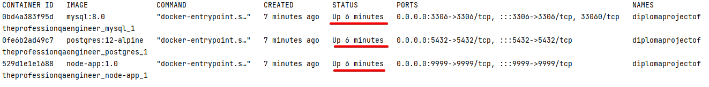

# DiplomaProjectOfTheProfessionQAEngineer 

# Дипломный проект профессии «Тестировщик»

Дипломный проект представляет собой автоматизацию тестирования комплексного сервиса, взаимодействующего с СУБД и API
Банка.

## Документация

[План автоматизации тестирования веб-формы сервиса покупки туров интернет-банка](documents/Plan.md)

[Отчёт о проведенном тестировании](documents/Report.md)

[Отчёт о проведённой автоматизации](documents/Summary.md)

## Запуск приложения

Перед запуском необходимо выполнить следующие предусловия. Если у вас уже есть необходимое ПО, то понадобится только п.1 и запуск Docker.

*Предусловия:*
1. Необходимо склонировать репозиторий или скачать архив по [ссылке](https://github.com/Tanya-ui-hub/DiplomaProjectOfTheProfessionQAEngineer.git). Или воспользоваться VCS Git, встроенной в
   IntelliJ IDEA.
2. Установить и запустить Docker Desktop. Это можно сделать [здесь](https://docs.docker.com/get-docker/) в зависимости от операционной системы. Дополнительные инструкции по установке Docker [ссылке](https://github.com/netology-code/aqa-homeworks/blob/master/docker/installation.md)
3. Открыть проект в IntelliJ IDEA

### Запуск

### Техническая часть

1. Запустить необходимые базы данных (MySQL и PostgreSQL), а также NodeJS. Параметры для запуска хранятся в
   файле `docker-compose.yml`. Для запуска необходимо ввести в терминале команду:

> * `docker-compose up -d --force-recreate`

2. В новой вкладке терминала ввести следующую команду в зависимости от базы данных

> * `java -Dspring.datasource.url=jdbc:mysql://localhost:3306/app -Dspring.datasource.username=user -Dspring.datasource.password=pass -Durl="jdbc:mysql://localhost:3306/app" -jar artifacts/aqa-shop.jar` - для MySQL
> * `java -Dspring.datasource.url=jdbc:postgresql://localhost:5432/appps -Dspring.datasource.username=userps -Dspring.datasource.password=passps -jar artifacts/aqa-shop.jar` - для PostgreSQL

3. Проверка работающих контейнеров:

> * `docker ps`

> 

4. Приложение должно запуститься по адресу

> * `http://localhost:8080/`