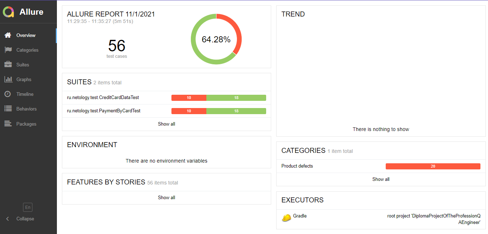
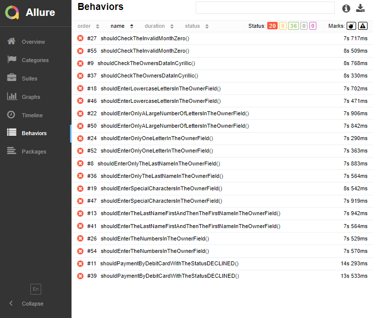

# Отчёт о проведённом тестировании

## Краткое описание
Автоматизировано тестирование комплексного сервиса покупки тура, взаимодействующего с СУБД и API Банка.

## Общее количество тест кейсов:
Общее количество тест-кейсов для обеих СУБД - 56 шт

## Статистика успешных/неуспешных кейсов

### При подключении к БД MySQL
> * Успешных кейсов 60.71% (34 кейсов)
> * Неуспешных кейсов 39.29% (22 кейсов)

   
Report

### При подключении к БД PostgreSQL
> * Успешных кейсов 60.71% (34 кейсов)
> * Неуспешных кейсов 39.29% (22 кейсов)

   
Report

## Общие рекомендации
1. Исправить орфографические ошибки ([Ошибка в слове Марракеш](https://github.com/Tanya-ui-hub/DiplomaProjectOfTheProfessionQAEngineer/issues/1))
2. Исправить название вкладки ([Ошибка в названии вкладки](https://github.com/Tanya-ui-hub/DiplomaProjectOfTheProfessionQAEngineer/issues/2))
3. Исправить цвет кнопки "Купить" и "Купить в кредит", чтобы при нажатии они меняли цвет ([Не меняется цвет кнопки, при смене вкладки](https://github.com/Tanya-ui-hub/DiplomaProjectOfTheProfessionQAEngineer/issues/3))
4. Исправить описание ппустых полей ([Неправильный текст ошибки у пустых полей во вкладке "Купить" и "Купить в кредит](https://github.com/Tanya-ui-hub/DiplomaProjectOfTheProfessionQAEngineer/issues/4))
5. Исправить успешное выполнение операций со статусом карты "DECLINED" ([Операция одобряется банком при вводе в поле "Номер карты" номера карты, статус которой DECLINED](https://github.com/Tanya-ui-hub/DiplomaProjectOfTheProfessionQAEngineer/issues/5))
6. Исправить ограничив ввод в поле месяц "00" и успешное выполнение операций ([Успешная операция при введении в поле "Месяц" значения "00" во вкладке "Купить" и "Купить в кредит"](https://github.com/Tanya-ui-hub/DiplomaProjectOfTheProfessionQAEngineer/issues/6))
7. Исправить для поля "Владелец" ограничив на вводимые символы - только английские буквы, нечувствительные к регистру ([Операция одобряется банком при заполнении поля "Владелец" числами вместо букв](https://github.com/Tanya-ui-hub/DiplomaProjectOfTheProfessionQAEngineer/issues/7))
8. Исправить для поля "Владелец" ограничив на вводимые символы - только английские буквы, нечувствительные к регистру ([Операция одобряется банком при заполнении поля "Владелец" русскими буквами](https://github.com/Tanya-ui-hub/DiplomaProjectOfTheProfessionQAEngineer/issues/8))
9. Исправить для поля "Владелец" ограничив на вводимые символы - только английские буквы, нечувствительные к регистру ([Операция одобряется банком при заполнении поля "Владелец" спец символами](https://github.com/Tanya-ui-hub/DiplomaProjectOfTheProfessionQAEngineer/issues/9))
10. Исправить дефекты связанные с непропадающими сообщениями об ошибках ([После отправки формы "Оплата по карте", с заполнением полей валидными значениями, сообщения о некорректном заполнении полей не пропадают ](https://github.com/Tanya-ui-hub/DiplomaProjectOfTheProfessionQAEngineer/issues/10))

**Полный список найденных дефектов находится в [Issues](https://github.com/Tanya-ui-hub/DiplomaProjectOfTheProfessionQAEngineer/issues)**
